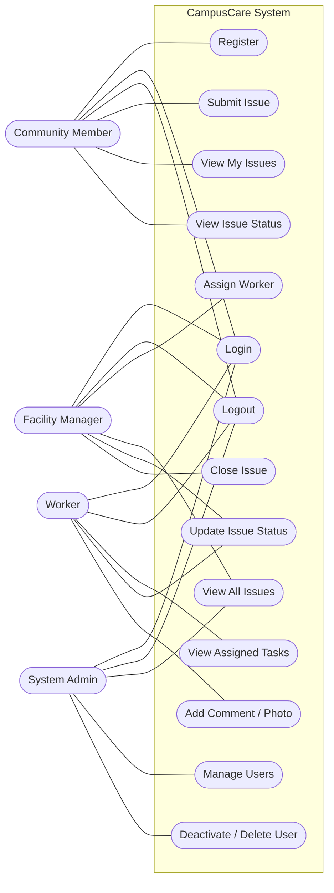

# Software Requirements Specification — CampusCare

**Version:** 1.0  
**Date:** May 2026  
**Team:** Micho · Ali · Youssef · Eyad

---

## 1. Introduction

### 1.1 Purpose

This document defines the functional and non-functional requirements for CampusCare, a mobile platform for reporting and managing campus facility issues. It is intended for the development team, testers, and academic evaluators.

### 1.2 Scope

CampusCare is a cross-platform mobile application (iOS and Android) backed by a REST API. It enables campus community members to report physical issues, facility managers to coordinate repairs, workers to execute and document tasks, and administrators to govern user accounts.

### 1.3 Definitions

| Term | Meaning |
|---|---|
| Issue | A reported campus problem (e.g. broken light, leaking pipe) |
| Assignment | A link between an issue and the worker tasked with it |
| Status | Current stage of an issue: `pending`, `in_progress`, or `resolved` |
| Session | A JWT access token issued on login, valid until expiry |

---

## 2. User Roles

| Role | Description |
|---|---|
| **Community Member** | Any campus user who can report and track issues |
| **Facility Manager** | Staff responsible for assigning and closing issues |
| **Worker** | Field staff who execute repairs and log progress |
| **System Admin** | Platform administrator who governs user accounts |

---

## 3. Functional Requirements

### 3.1 Authentication (all roles)

| ID | Requirement |
|---|---|
| FR-A01 | A user can register with name, email, password, and role (community\_member, facility\_manager, or worker) |
| FR-A02 | Admin accounts are created only via the server-side seed script; self-registration as admin is rejected |
| FR-A03 | A registered user can log in with email and password and receives a JWT session token |
| FR-A04 | A logged-in user can log out, invalidating their session |
| FR-A05 | A deactivated account receives a 403 error on login with an explanatory message |

### 3.2 Community Member

| ID | Requirement |
|---|---|
| FR-C01 | A community member can submit a new issue with title, description, category, location, and an optional photo |
| FR-C02 | A community member can view only the issues they submitted |
| FR-C03 | A community member can view the current status and status history of their issues |
| FR-C04 | A community member can view worker comments and photos attached to their issues |
| FR-C05 | A community member can update their display name |

### 3.3 Facility Manager

| ID | Requirement |
|---|---|
| FR-M01 | A facility manager can view all issues regardless of submitter |
| FR-M02 | A facility manager can filter issues by status |
| FR-M03 | A facility manager can assign an active worker to an issue; assigning automatically sets status to `in_progress` |
| FR-M04 | A facility manager can change issue status to `in_progress` or `resolved` |
| FR-M05 | A facility manager can delete any issue |
| FR-M06 | A facility manager can view worker comments on any issue |

### 3.4 Worker

| ID | Requirement |
|---|---|
| FR-W01 | A worker can view only issues assigned to them |
| FR-W02 | A worker can mark an assigned issue as `in_progress` |
| FR-W03 | A worker can mark an assigned issue as `resolved` |
| FR-W04 | A worker can post text comments on their assigned issues |
| FR-W05 | A worker can attach a photo to a comment (uploaded via the backend to Supabase Storage) |

### 3.5 System Admin

| ID | Requirement |
|---|---|
| FR-AD01 | An admin can view all user accounts with name, email, role, and active status |
| FR-AD02 | An admin can deactivate or reactivate any non-admin account |
| FR-AD03 | An admin can permanently delete any non-admin account |
| FR-AD04 | An admin cannot deactivate or delete another admin account |
| FR-AD05 | An admin can view all issues across all users |

---

## 4. Non-Functional Requirements

| ID | Category | Requirement |
|---|---|---|
| NFR-01 | Performance | API responses complete within 2 seconds under normal load |
| NFR-02 | Security | All endpoints except `/auth/login` and `/auth/register` require a valid JWT |
| NFR-03 | Security | Passwords are stored as Supabase Auth hashes; no plaintext storage |
| NFR-04 | Security | The service role key is never sent to the client; all privileged DB writes go through the backend |
| NFR-05 | Usability | Role-based navigation routes users to the correct screen immediately after login |
| NFR-06 | Reliability | The admin seed script is idempotent; running it multiple times does not create duplicate accounts |
| NFR-07 | Portability | The app runs on iOS and Android via Expo Go without native build steps |
| NFR-08 | Maintainability | All backend authorization logic lives in Express middleware and controllers, not in database RLS |

---

## 5. Constraints

- The mobile client requires an active network connection to reach the backend API.
- Image uploads are capped at 10 MB per file; only JPEG, PNG, WebP, and GIF are accepted.
- The backend must be run on Node.js 20 or later.
- Physical device testing requires the device and the development machine to be on the same LAN.

---

## 6. UML Use-Case Diagram

---

## 7. Database Design

See [schema.md](schema.md) for the full ERD, CREATE TABLE statements, indexes, and RLS policies.

**Tables:** `profiles`, `issues`, `assignments`, `comments`, `status_history`

**Key relationships:**
- A profile creates many issues
- An issue has at most one active assignment
- An assignment links an issue to a worker profile
- An issue has many comments, each authored by a profile
- An issue has a status history log tracking every status transition

---

## 8. Technology Stack

| Component | Technology | Version |
|---|---|---|
| Mobile app | React Native | 0.81 |
| Routing | Expo Router | 6 |
| Language | TypeScript | 5.9 |
| Backend | Node.js + Express | 20 + 4.x |
| Database | PostgreSQL (via Supabase) | 15 |
| Auth | Supabase Auth | — |
| Storage | Supabase Storage | — |
| API client | Supabase JS | 2.x |
