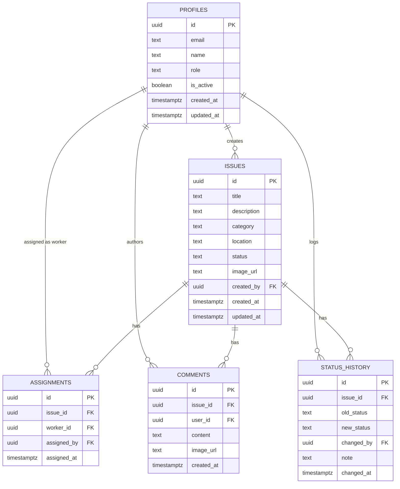

# Database Schema — CampusCare

PostgreSQL 15 via Supabase. All tables live in the `public` schema. User identity is managed by Supabase Auth (`auth.users`); the `profiles` table mirrors each auth user and is the foreign-key target for all application tables.

---

## ERD



---

## Table Definitions

### profiles

Mirrors `auth.users`. Created automatically by the `on_auth_user_created` trigger when a new auth user is inserted.

```sql
CREATE TABLE public.profiles (
  id          UUID        PRIMARY KEY REFERENCES auth.users(id) ON DELETE CASCADE,
  email       TEXT        NOT NULL,
  name        TEXT        NOT NULL,
  role        TEXT        NOT NULL CHECK (role IN ('community_member','facility_manager','worker','admin')),
  is_active   BOOLEAN     NOT NULL DEFAULT true,
  created_at  TIMESTAMPTZ NOT NULL DEFAULT now(),
  updated_at  TIMESTAMPTZ NOT NULL DEFAULT now()
);
```

### issues

```sql
CREATE TABLE public.issues (
  id          UUID        PRIMARY KEY DEFAULT gen_random_uuid(),
  title       TEXT        NOT NULL,
  description TEXT,
  category    TEXT        NOT NULL CHECK (category IN ('maintenance','infrastructure','sustainability','cleanliness','other')),
  location    TEXT        NOT NULL,
  status      TEXT        NOT NULL DEFAULT 'pending' CHECK (status IN ('pending','in_progress','resolved')),
  image_url   TEXT,
  created_by  UUID        NOT NULL REFERENCES public.profiles(id) ON DELETE CASCADE,
  created_at  TIMESTAMPTZ NOT NULL DEFAULT now(),
  updated_at  TIMESTAMPTZ NOT NULL DEFAULT now()
);
```

### assignments

One active assignment per issue. The previous assignment is deleted when a new one is inserted.

```sql
CREATE TABLE public.assignments (
  id          UUID        PRIMARY KEY DEFAULT gen_random_uuid(),
  issue_id    UUID        NOT NULL REFERENCES public.issues(id) ON DELETE CASCADE,
  worker_id   UUID        NOT NULL REFERENCES public.profiles(id) ON DELETE CASCADE,
  assigned_by UUID        NOT NULL REFERENCES public.profiles(id),
  assigned_at TIMESTAMPTZ NOT NULL DEFAULT now(),
  UNIQUE (issue_id)
);
```

### comments

```sql
CREATE TABLE public.comments (
  id          UUID        PRIMARY KEY DEFAULT gen_random_uuid(),
  issue_id    UUID        NOT NULL REFERENCES public.issues(id) ON DELETE CASCADE,
  user_id     UUID        NOT NULL REFERENCES public.profiles(id) ON DELETE CASCADE,
  content     TEXT        NOT NULL DEFAULT '',
  image_url   TEXT,
  created_at  TIMESTAMPTZ NOT NULL DEFAULT now()
);
```

### status_history

Append-only log. A row is inserted on every status change.

```sql
CREATE TABLE public.status_history (
  id          UUID        PRIMARY KEY DEFAULT gen_random_uuid(),
  issue_id    UUID        NOT NULL REFERENCES public.issues(id) ON DELETE CASCADE,
  old_status  TEXT,
  new_status  TEXT        NOT NULL,
  changed_by  UUID        NOT NULL REFERENCES public.profiles(id),
  note        TEXT,
  changed_at  TIMESTAMPTZ NOT NULL DEFAULT now()
);
```

---

## Indexes

```sql
CREATE INDEX ON public.issues (created_by);
CREATE INDEX ON public.issues (status);
CREATE INDEX ON public.assignments (issue_id);
CREATE INDEX ON public.assignments (worker_id);
CREATE INDEX ON public.comments (issue_id);
CREATE INDEX ON public.status_history (issue_id);
```

---

## Auto-Create Profile Trigger

When Supabase Auth creates a new user, this trigger writes the matching profile row. `raw_user_meta_data` is set by the backend's `auth.admin.createUser()` call and carries `name` and `role`.

```sql
CREATE OR REPLACE FUNCTION public.handle_new_user()
RETURNS TRIGGER
LANGUAGE plpgsql
SECURITY DEFINER
AS $$
BEGIN
  INSERT INTO public.profiles (id, email, name, role)
  VALUES (
    NEW.id,
    NEW.email,
    COALESCE(NEW.raw_user_meta_data->>'name', 'User'),
    COALESCE(NEW.raw_user_meta_data->>'role', 'community_member')
  );
  RETURN NEW;
END;
$$;

CREATE TRIGGER on_auth_user_created
  AFTER INSERT ON auth.users
  FOR EACH ROW EXECUTE FUNCTION public.handle_new_user();
```

---

## Row Level Security

RLS is enabled on all tables. Because all writes go through the backend using the **service role key**, which bypasses RLS, the policies below cover direct client access only.

```sql
-- Enable RLS
ALTER TABLE public.profiles       ENABLE ROW LEVEL SECURITY;
ALTER TABLE public.issues         ENABLE ROW LEVEL SECURITY;
ALTER TABLE public.assignments    ENABLE ROW LEVEL SECURITY;
ALTER TABLE public.comments       ENABLE ROW LEVEL SECURITY;
ALTER TABLE public.status_history ENABLE ROW LEVEL SECURITY;

-- profiles: users can read all profiles, update only their own
CREATE POLICY "profiles_select" ON public.profiles FOR SELECT USING (true);
CREATE POLICY "profiles_update" ON public.profiles FOR UPDATE USING (auth.uid() = id);

-- issues: anyone authenticated can read; creator or manager can write
CREATE POLICY "issues_select" ON public.issues FOR SELECT USING (auth.uid() IS NOT NULL);
CREATE POLICY "issues_insert" ON public.issues FOR INSERT WITH CHECK (auth.uid() = created_by);
CREATE POLICY "issues_update" ON public.issues FOR UPDATE USING (auth.uid() IS NOT NULL);
CREATE POLICY "issues_delete" ON public.issues FOR DELETE USING (auth.uid() IS NOT NULL);

-- comments: authenticated read; author writes their own
CREATE POLICY "comments_select" ON public.comments FOR SELECT USING (auth.uid() IS NOT NULL);
CREATE POLICY "comments_insert" ON public.comments FOR INSERT WITH CHECK (auth.uid() = user_id);

-- assignments and status_history: authenticated read only (writes via service role)
CREATE POLICY "assignments_select" ON public.assignments FOR SELECT USING (auth.uid() IS NOT NULL);
CREATE POLICY "history_select"     ON public.status_history FOR SELECT USING (auth.uid() IS NOT NULL);
```

---

## Storage

Images are stored in a single public Supabase Storage bucket named `issue-images`. All uploads go through the backend (`POST /api/upload`) using the service role key, so no client-side storage policy is required for writes. The bucket is configured for public reads so that image URLs can be rendered in the app without authentication headers.
